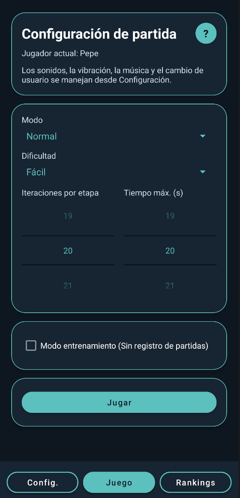
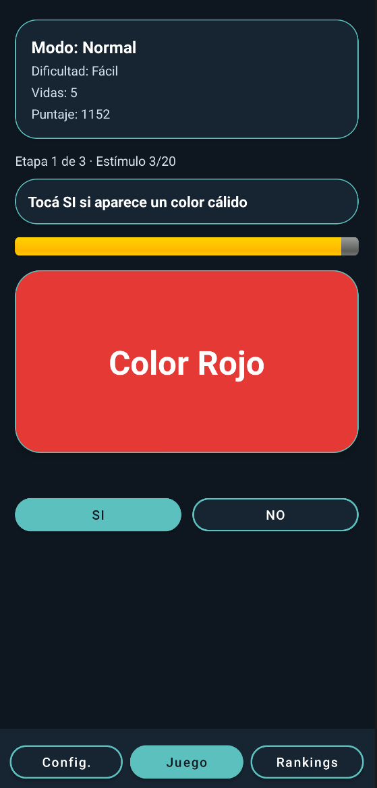
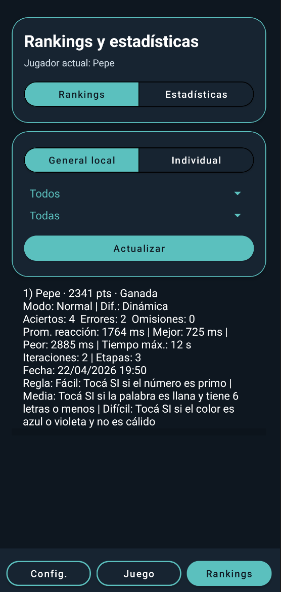
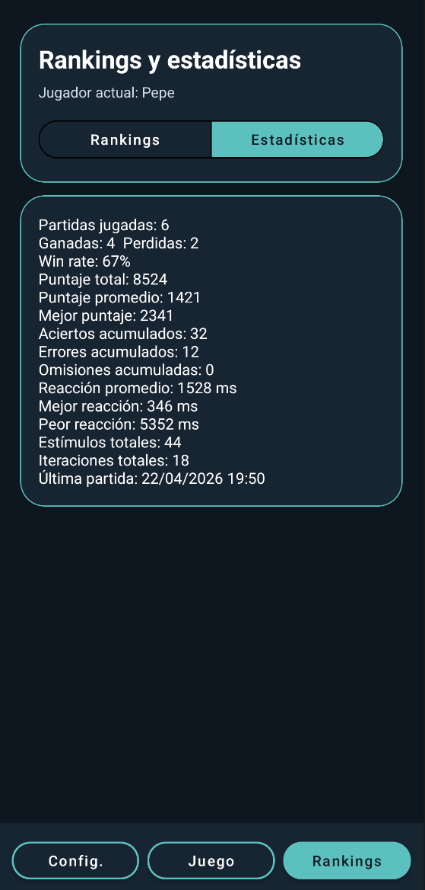

# Reaction Challenge — Android App

Android game focused on reaction speed and attention, built with Java and XML.

The application provides multiple game modes, configurable difficulty, local persistence, and player rankings.

## Screenshots

Selected screenshots from an Android build highlight game configuration, a live reaction challenge, locally stored rankings, and cumulative player statistics. Click any screenshot to view it at full resolution.

<table>
  <tr>
    <th>Game Configuration</th>
    <th>Live Challenge</th>
  </tr>
  <tr>
    <td align="center"><a href="docs/screenshots/game-configuration.webp"></a></td>
    <td align="center"><a href="docs/screenshots/live-challenge.webp"></a></td>
  </tr>
  <tr>
    <th>Local Rankings</th>
    <th>Player Statistics</th>
  </tr>
  <tr>
    <td align="center"><a href="docs/screenshots/local-rankings.webp"></a></td>
    <td align="center"><a href="docs/screenshots/player-statistics.webp"></a></td>
  </tr>
</table>

## Features

- Local player login
- Normal, inverse, and dynamic game modes
- Color, number, and word stimuli
- Configurable sound, vibration, and music
- Difficulty-based game rules
- Individual ranking
- Local global ranking
- Training mode
- Persistent settings and results

Training mode does not store results.

## Tech Stack

- Java
- Android SDK
- XML layouts
- SQLite
- SharedPreferences
- AndroidX
- Material Components
- Gradle

## Requirements

- Android Studio
- Android SDK 34 or newer
- Android 7.0 / API 24 or newer

## Running the Project

1. Open the repository root in Android Studio.
2. Wait for Gradle synchronization to finish.
3. Run the application on an emulator or Android device.

You can also build the debug APK with:

```bash
./gradlew assembleDebug
```

On Windows:

```bash
gradlew.bat assembleDebug
```

## Notes

Player data and settings are stored locally on the device.

The application also includes a local audio loop used as background music.
